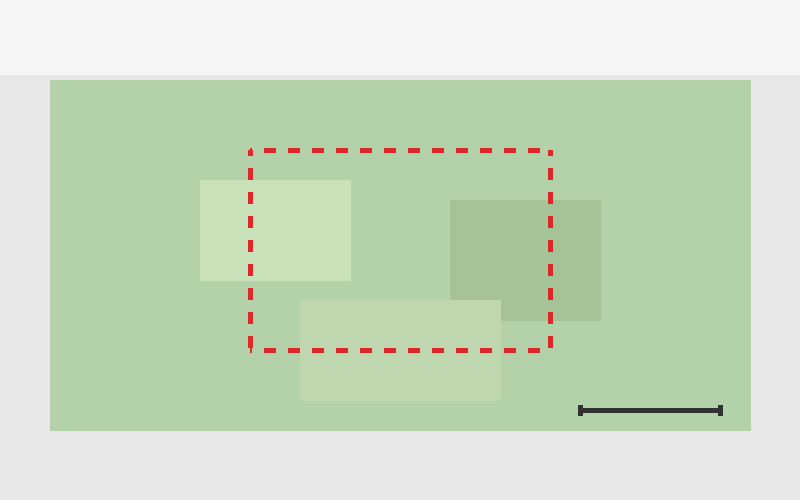

# Example Markdown Document

To convert to a pdf:
```
pandoc example.md -o example.pdf
```

## Text Formatting

This is **bold**, this is *italic*, this is ***bold and italic***, and this is ~~strikethrough~~. You can also use `inline code` for short snippets.

> This is a blockquote. It can span multiple lines
> and is useful for highlighting important information.

## Lists

### Unordered
- Item one
  - Sub-item A
  - Sub-item B
- Item two
- Item three

### Ordered
1. First step
2. Second step
   1. Sub-step 2a
   2. Sub-step 2b
3. Third step

### Task List
- [x] Completed task
- [ ] Incomplete task
- [ ] Another task to do

## Links

[Exploration Institute](https://example.com)

## Images




## Tables

| Parameter       | Value   | Units   | Notes              |
|-----------------|---------|---------|---------------------|
| Altitude        | 12,500  | ft MSL  | Nominal cruise      |
| Ground Speed    | 145     | kts     | Average over run    |
| Sensor FOV      | 30.0    | deg     | Cross-track         |
| Frame Rate      | 60      | Hz      | Full resolution     |
| GSD             | 0.15    | m       | At nadir            |

### Right-Aligned Numeric Table

| Metric              | Run 1 | Run 2 | Run 3 | Mean  |
|----------------------|------:|------:|------:|------:|
| SNR (dB)            | 42.3  | 41.8  | 43.1  | 42.4  |
| RMS Error (m)       |  0.12 |  0.15 |  0.11 |  0.13 |
| Coverage (%)        | 98.7  | 97.2  | 99.1  | 98.3  |
| Processing Time (s) |  320  |  345  |  310  |  325  |

## Code Blocks

```python
import numpy as np

def compute_gsd(altitude_m, focal_length_mm, pixel_size_um):
    """Compute ground sample distance."""
    pixel_size_m = pixel_size_um * 1e-6
    focal_length_m = focal_length_mm * 1e-3
    return (altitude_m * pixel_size_m) / focal_length_m
```

```bash
ffmpeg -i input.mp4 -vf "fps=1" frame_%04d.png
```

## Math Equations

### Inline Math

The ground sample distance is given by $\text{GSD} = \frac{H \cdot p}{f}$ where $H$ is altitude, $p$ is pixel size, and $f$ is focal length.

### Block Equations

The signal-to-noise ratio in decibels:

$$
\text{SNR}_{\text{dB}} = 10 \log_{10}\left(\frac{P_{\text{signal}}}{P_{\text{noise}}}\right)
$$

The radiance reaching the sensor:

$$
L(\lambda) = \frac{\rho(\lambda) \cdot E_s(\lambda) \cdot \cos\theta_s}{\pi} \cdot \tau_{\text{atm}}(\lambda)
$$

A matrix transformation for coordinate conversion:

$$
\begin{bmatrix} x' \\ y' \\ z' \end{bmatrix}
=
\begin{bmatrix}
\cos\phi & -\sin\phi & 0 \\
\sin\phi & \cos\phi & 0 \\
0 & 0 & 1
\end{bmatrix}
\begin{bmatrix} x \\ y \\ z \end{bmatrix}
$$

The root mean square error:

$$
\text{RMSE} = \sqrt{\frac{1}{N} \sum_{i=1}^{N} (y_i - \hat{y}_i)^2}
$$

## Horizontal Rule

---

## Footnotes

Remote sensing data was collected under clear-sky conditions[^1] using a calibrated sensor[^2].

[^1]: Cloud cover < 5% as verified by GOES-16 imagery.
[^2]: Radiometric calibration performed within 30 days of collection.

## Definition List (HTML)

<dl>
  <dt>GSD</dt>
  <dd>Ground Sample Distance — the distance between pixel centers on the ground.</dd>
  <dt>NIIRS</dt>
  <dd>National Imagery Interpretability Rating Scale — a measure of image quality.</dd>
</dl>

## Collapsible Section

<details>
<summary>Click to expand processing parameters</summary>

| Parameter          | Value       |
|--------------------|-------------|
| Interpolation      | Bilinear    |
| Ortho Method       | RPC         |
| DEM Source         | SRTM 30m    |
| Output Projection  | UTM Zone 11N|

</details>
